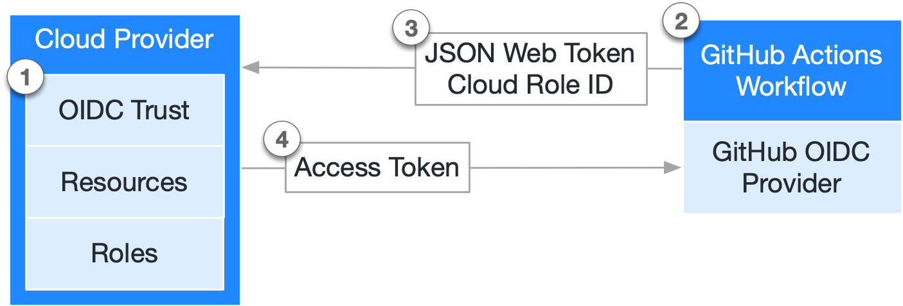

# Autentisering med Workload Identity Federation


Når man bruker langlevde tokens til autentisering slik som f.eks. service account tokens er det en risiko for at disse blir lekket og blir en angrepsvektor inn mot infrastrukturen. Dette vil vi unngå, og det er også grunnen til at Google anbefaler å ikke bruke slike service account tokens til fordel for det som heter Workload Identity Federation der det er mulig. GitHub skriver om noen fordeler med å bruke dette i [About security hardening with OpenID Connect](https://docs.github.com/en/actions/deployment/security-hardening-your-deployments/about-security-hardening-with-openid-connect) .

Kort oppsummert er Workload Identity Federation en måte å lese signerte JWT-er fra andre identity providers og bruke dette til å gi tilgang til service kontoer i GCP. Google forteller mer om dette her: [https://cloud.google.com/iam/docs/workload-identity-federation](https://cloud.google.com/iam/docs/workload-identity-federation)

Når vi bruker GitHub Actions har GitHub en egen OIDC identity provider i stacken deres som vi kan ta i bruk. Vi kan da bruke OIDC identity provideren som ligger i GitHub stacken til å utstede en JWT som er signert av GitHub hver gang et bygg kjøres. På denne måten kan SKIP vite at denne autentiseringsforespørselen ble kjørt i tilknytning til bygget deres og gi dere de tilgangene som dere krever, for eksempel tilgang til å deploye til namespacet deres på kubernetes. Da bruker man kun kortlevde nøkler og unngår å bruke service account tokens med lang varighet som kan lekkes og bli en angrepsvektor for trusselaktører inn mot infrastrukturen vår.

## Oppsett av GitHub Action

Når man skal sette opp autentisering mot GCP med Workload Identity Federation er det en fordel å ha lest gjennom GitHub sin artikkel om [https://docs.github.com/en/actions/deployment/security-hardening-your-deployments/configuring-openid-connect-in-google-cloud-platform#updating-your-github-actions-workflow](https://docs.github.com/en/actions/deployment/security-hardening-your-deployments/configuring-openid-connect-in-google-cloud-platform#updating-your-github-actions-workflow) , og spesifikt kapittelet som heter “Updating your GitHub Actions workflow”. Her beskriver de de to trinnene man må gjøre:

- Konfigurere tilgang til å generere ID-tokens
- Bruke [https://github.com/google-github-actions/auth](https://github.com/google-github-actions/auth) actionen til å autentisere mot GCP

SKIP-teamet vil ha konfigurert en workload identity provider og service account som dere kan putte rett inn i provideren over. Disse er ikke hemmelige men vil variere avhengig av miljø man skal deploye mot, så det kan være hensiktsmessig å ha de som variabler, som vist lenger nede.

```yaml
permissions:
  contents: read
  id-token: write

jobs:
  build:
    runs-on: ubuntu-latest
    steps:
    - name: Checkout
      uses: actions/checkout@v2

    - id: auth
      name: Authenticate to GCP
      uses: google-github-actions/auth@v0
      with:
        workload_identity_provider: projects/your-project-number/locations/global/workloadIdentityPools/your-pool/providers/your-provider
        service_account: your-account@your-project.iam.gserviceaccount.com
        project_id: kubernetes-dev-94b9

```

Eventuelt kan du ha en egen setup-env jobb som lager outputs du kan bruke senere, slik at provider, service account og project id er variabler i stedet for hardkodede strings.

Eksempel:

```yaml
permissions:
  contents: read
  id-token: write

env:
  PROJECT_ID: kubernetes-dev-94b9
  SERVICE_ACCOUNT: your-account@your-project.iam.gserviceaccount.com
  WORKLOAD_IDENTITY_PROVIDER: projects/your-project-number/locations/global/workloadIdentityPools/your-pool/providers/your-provider

jobs:
  setup-env:
    runs-on: ubuntu-latest
    outputs:
      project_id: ${{ steps.set-output.outputs.project_id }}
      service_account: ${{ steps.set-output.outputs.service_account }}
      workload_identity_provider: ${{ steps.set-output.outputs.workload_identity_provider }}
    steps:
      - name: Set outputs
        id: set-output
        run: |
          echo "project_id=$PROJECT_ID" >> $GITHUB_OUTPUT
          echo "service_account=$SERVICE_ACCOUNT" >> $GITHUB_OUTPUT
          echo "workload_identity_provider=$WORKLOAD_IDENTITY_PROVIDER" >> $GITHUB_OUTPUT

  build:
    needs: [setup_env]
    runs-on: ubuntu-latest
    steps:
    - name: Checkout
      uses: actions/checkout@v2

    - id: auth
      name: Authenticate to GCP
      uses: google-github-actions/auth@v0
      with:
        workload_identity_provider: ${{ needs.setup-env.outputs.workload_identity_provider }}
        service_account: ${{ needs.setup-env.outputs.service_account }}
        project_id: ${{ needs.setup-env.outputs.project_id }}

  build-again:
    needs: [setup_env]
    runs-on: ubuntu-latest
    steps:
    - name: Checkout
      uses: actions/checkout@v2

    - id: auth
      name: Authenticate to GCP
      uses: google-github-actions/auth@v0
      with:
        workload_identity_provider: ${{ needs.setup-env.outputs.workload_identity_provider }}
        service_account: ${{ needs.setup-env.outputs.service_account }}
        project_id: ${{ needs.setup-env.outputs.project_id }}

```
