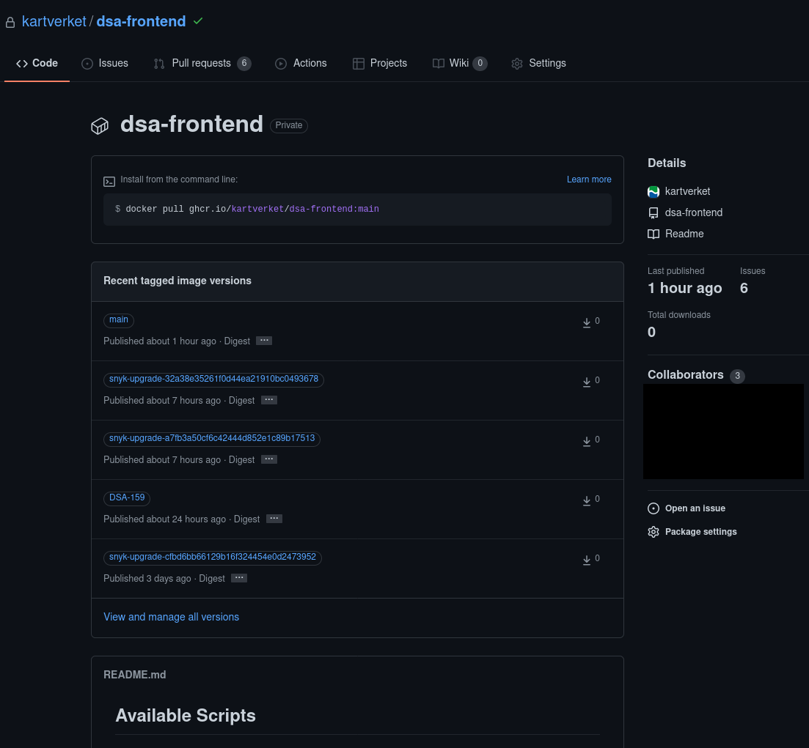

# 🧰 GitHub Actions

## Generelt

GitHub actions er GitHubs CI/CD-system. Med dette systemet kan man kjøre bygg som er tett integrert med kodebasen og bruke et økosystem av integrasjoner og ferdiglagde actions via [GitHub Marketplace](https://github.com/marketplace) .

Dere kommer til å møte på en del forskjellige verktøy når dere skal deploye til SKIP:

- SKIP er kjøremiljøet for containere i Kartverket. Vi regner ikke GitHub som en del av SKIP, men det er en så sentral komponent i å deploye til SKIP-teamet er med å drifte GitHub-organisasjonen til Kartverket
- [GitHub Actions](https://docs.github.com/en/actions/) som er CI/CD-miljøet for å kjøre jobber som å bygge containere fra kildekode og kjøre terraform plan og apply
- [Terraform](https://kartverket.atlassian.net/wiki/spaces/SKIPDOK/pages/309952968/Bruk+av+Terraform+WIP) som er [IaC](https://en.wikipedia.org/wiki/Infrastructure_as_code) -verktøyet som lar oss beskrive det ønskede miljøet i kode og eksekverer kommandoer for å modifisere miljøet slik at det blir slik som beskrevet
- [github-workflows](https://github.com/kartverket/github-workflows) som er gjenbrukbare jobber man kan bruke i sine pipelines for å gjøre oppsettet lettere. Denne inneholder hovedsakelig den gjenbrukbare jobben “run-terraform”. Denne kan benyttes for å enkelt autentisere seg mot GCP og bruke terraform på en sikker måte.
- [Google Cloud](https://cloud.google.com/) og [Google Anthos](https://cloud.google.com/anthos/) som er miljøet som kjører [Kubernetes](https://cloud.google.com/kubernetes-engine) -miljøet hvor containerene kjører
- [skiperator](https://github.com/kartverket/skiperator-poc) er en [operator](https://operatorframework.io/what/) som gjør det enklere å sette opp en applikasjon som følger best practices. Skiperator definerer en Application custom resource som blir fylt ut av produktteamene og deployet med Terraform
- [Nacho SKIP](https://github.com/kartverket/nacho-skip) signerer container images med en kryptografisk signatur etter de er bygget

GitHub Actions er et CI-systemet som SKIP legger opp til at alle produktteam skal kunne bruke for å automatisere bygging av Docker-images i tillegg til muligheter for å opprette infrastruktur i skyen ved hjelp av Terraform på en automatisert måte.

Actions lages ved å skrive YAML-filer i `.github/workflows` -mappa i roten av repoet. Man kan også trykke på “Actions” og “New workflow” i GitHub og få opp dialogen over. Der kan man velge fra et eksisterende bibliotek med eksempler på Actions som kan hjelpe med å komme i gang med en action. For eksempel kan man trykke “View all” på “Continous Integration” for å finne eksempler på hvordan man bygger med java eller node.js. DIsse er ofte gode utgangspunkt når man skal sette opp et nytt bygg.

Les [https://docs.github.com/en/actions/learn-github-actions/understanding-github-actions](https://docs.github.com/en/actions/learn-github-actions/understanding-github-actions) for en introduksjon til Actions.

Se [https://docs.github.com/en/actions/learn-github-actions/workflow-syntax-for-github-actions](https://docs.github.com/en/actions/learn-github-actions/workflow-syntax-for-github-actions) for referanse av mulige verdier.

## Lagring av images

Det anbefalte måten å publisere images er nå til GitHub Container Registry ([ghcr.io](http://ghcr.io/)). Dette kan gjøres enkelt ved hjelp av GitHub Actions.

Se denne artikkelen for mer informasjon om ghcr: [https://docs.github.com/en/packages/working-with-a-github-packages-registry/working-with-the-container-registry](https://docs.github.com/en/packages/working-with-a-github-packages-registry/working-with-the-container-registry) .

Eksempler for [publisering av container images til GitHub finnes her](https://docs.github.com/en/actions/publishing-packages/publishing-docker-images#publishing-images-to-github-packages) .

Dersom dere bruker metoden over vil dere merke at dere ikke trenger å sette tags på docker imaget dere bygger. Dette vil settes automatisk basert på en “sane default” ut i fra hvilke branch man er på og hvilke kontekst bygget gjøres i (commit, PR, tag). [De resulterende taggene er dokumentert her](https://github.com/docker/metadata-action#basic) . Tags kan også tilpasses om ikke default er passende for prosjektet.

Resultatet blir å finne på GitHub repositoriet til koden og ser slik ut:

 

Det er anbefalt å kjøre skannere på images som bygges før de deployes. Da vil sårbarheter kunne vises i [Utviklerportalen](https://kartverket.dev/). Se [Pharos](./pharos.md) for å komme i gang med kodeskanning.

## Deployment

For deployment brukes Argo CD som det dedikert deployment-verktøy. Se [Argo CD](../09-argo-cd/index.md) for mer informasjon om hvordan man tar i bruk dette.

Det vil finnes prosjekter som bruker Terraform, enten fordi de hadde oppstart før Argo CD eller fordi de har spesielle behov som tilsier at de trenger Terraform. Disse prosjektene kan se på [Bruk av Terraform](bruk-av-terraform.md) for videre dokumentasjon. For nye prosjekter anbefaler vi Argo CD.
