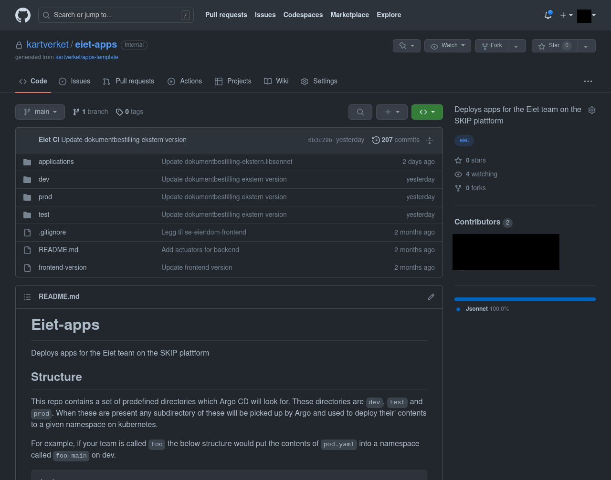
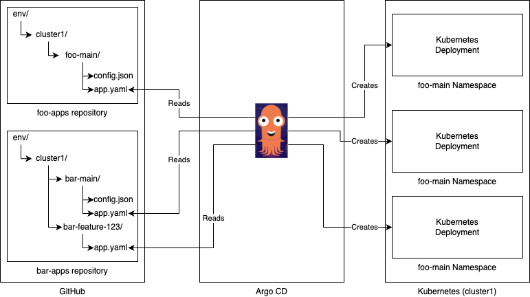
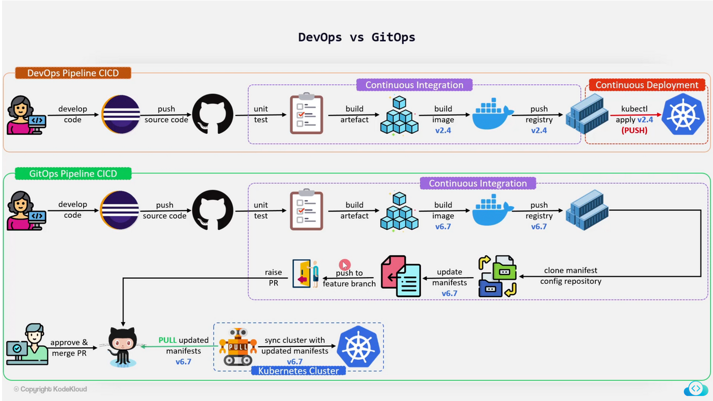

# Hva er et apps-repo



Når dere [kommer i gang med Argo](./01-komme-i-gang-med-argocd.md) får teamet deres et apps-repo. Hva er dette og hvordan bruker man det?

Et apps-repo inneholder [manifest-filer](https://kartverket.atlassian.net/wiki/spaces/SKIPDOK/pages/306873095) for alle applikasjonene som et produktteam har ansvaret for. Disse manifest-filene beskriver hvordan applikasjonen skal se ut på kubernetes, hvilke container images som skal deployes, hvor mange replikaer som skal kjøre, og så videre. Vanligvis er dette i form av [Skiperator Application-manifester](https://github.com/kartverket/skiperator) og [ExternalSecret-manifester](https://kartverket.atlassian.net/wiki/spaces/SKIPDOK/pages/554566739). Argo CD leser disse og synkroniserer dem ut til kubernetes-clusteret.

## Mappestruktur

Du vil se at et apps-repo har en predefinert mappestruktur. Den ser omtrent slik ut:

```
env/         # 1
   [cluster]/ # 2
      foo-main/  # 3
        app.yaml # 4
```

På env nivå (2) finner man mapper som gjenspeiler hvilket miljø det skal synkroniseres til. Dette er navnet på clusteret, enten `atkv3-dev`, `atvk3-prod`, `atgcp1-dev` eller `atgcp1-prod`.

På nivå 2 finner man navnet på namespacet som det skal deployes til. Dette må starte med et gitt prefiks, vanligvis produktnavnet (i dette tilfellet heter produktet `foo` ). Etter prefikset kan man skrive hva man vil, vanligvis navnet på branchen i git som er deployed her. Dette kan være nyttig om man ønsker å deploye en mer stabil `main` branch deployed i tillegg til å deploye pull requests som testes live før de merges.

Nivå 3, altså innholdet av mappen over, er et sett med en eller flere manifestfiler som beskriver applikasjonen. I eksempelet over vil `app.yaml` inneholde en [Skiperator Application manifest](https://github.com/kartverket/skiperator) som for eksempel kan se slik ut:

```yaml
apiVersion: skiperator.kartverket.no/v1alpha1
kind: Application
metadata:
  name: foo-frontend
spec:
  image: kartverket/example
  port: 8080
```



Når vi putter hele dette eksemplet sammen vil følgende skje:

- Produktteamet gjør en endring i apps-repoet
- Argo CD vil etter kort tid lese apps-repoet og finne den endrede `app.yaml` filen
- Argo CD ser at den er plassert i `dev` og `foo-main` mappene og oppretter `foo-main` namespacet på dev-clusteret
- Argo CD legger Application definisjonen inn i namespacet på Kubernetes
- Skiperator plukker opp endringen i namespacet og bygger ut Kubernetes-definisjonen for en applikasjon som skal kjøre `kartverket/example` imaget
- Kubernetes puller container imaget og starter podder som kjører applikasjonen

## Gjenbruke konfigurasjon

Man vil ofte få gjentagende konfigurasjon når man får flere applikasjoner, namespacer og miljøer. Det finnes metoder i Argo CD for å gjøre konfigurasjonen gjenbrukbar, og du vil finne dokumentasjon om disse på [Argo CD Tools](https://argo-cd.readthedocs.io/en/stable/user-guide/application_sources/) .

Flere produktteam har løst gjenbruk ved å bruke [http://jsonnet.org/](http://jsonnet.org/) som er støttet ut av boksen med Argo. Man kan se et eksempel av dette på [eiet-apps](https://github.com/kartverket/eiet-apps) . SKIP jobber med et [bibliotek med gjenbrukbare jsonnet-objekter](https://github.com/kartverket/wip-skip-libsonnet) .

Vi på SKIP anbefaler at dere starter med å sjekke inn vanlige YAML-filer mens dere lærer dere systemet. Når dere blir komfortable med Argo kan dere se på alternativene som er beskrevet over, da blir ikke læringskurven brattere enn nødvendig.

## Kildekode-repoer

Apps-repoer skal **ikke** inneholde kildekode. Apps-repoer har kun metadata om applikasjonen i form av manifest-filer. Dette kan man også lese om i [Best Practices for Argo CD](https://argo-cd.readthedocs.io/en/stable/user-guide/best_practices/#separating-config-vs-source-code-repositories).

Dette gjør at man får et tydelig skille mellom kildekoderepoer og apps-repoer. Kildekoderepoer har ansvaret for å lagre kode, bygge artefakter og container-imager. Apps-repoer beskriver den ønskede staten til applikasjonen på clusteret og Argo jobber mot å bringe clusteret i synk med denne staten. Dette gjør det også enkelt å forholde seg til apps-repoene som en “single source of truth” til applikasjonsstaten på clusteret.

## Deploye automatisk ved push



Man ønsker ofte å deploye ut nye versjoner av applikasjoner ved push til kildekoderepoer. Hvordan kan man gjøre dette med Argo CD?

Ved hvert push til et kildekoderepo kjøres et bygg for å bygge et byggartefakt og bygge et container image. Så snart dette imaget er pushet til et registry som [ghcr.io](http://ghcr.io/) vil man at dette skal legges ut på clusteret, og da må man oppdatere manifest-filene i apps-repoet. Man kan oppdatere disse filene manuelt for å trigge en synk, men det er også mulig å gjøre dette automatisk som en del av samme pipeline.

Etter imaget er publisert til [ghcr.io](http://ghcr.io/) puller bygget apps-repoet ved å bruke [https://github.com/actions/checkout](https://github.com/actions/checkout). Deretter endres filene til å inneholde referansen til det nye imaget, og disse filene commites lokalt. Hvordan disse filene endres er opp til produktteamet, men et forslag ligger i [Automation from CI Pipelines](https://argo-cd.readthedocs.io/en/stable/user-guide/ci_automation/). Til slutt pushes filene til repoet som vil trigge en synk med de oppdaterte manifestene.

Dette kan også gjøres med en PR istedenfor å pushe rett til apps-repoet om man vil ha en godkjenning før deploy.

For å logge inn på apps-repoet brukes metoden som beskrives i [Tilgang til repoer med tokens fra GitHub Actions](../08-github-actions/tilgang-til-repoer-med-tokens-fra-github-actions.md).

:::info
Dersom man bruker Argo CD til å opprette namespacer for alle branches og pull requests er det viktig å slette branchene når de ikke lenger er i bruk. Det er begrenset med kapasitet på clusterene og å anskaffe hardware, både on-prem og i sky, er ekstremt kostbart. Det holder å slette filene i apps-repoet for å rydde opp, noe som kan gjøres automatisk ved sletting av branches.
:::

### Eksempel på Github Actions

```yaml
name: build-and-deploy

on:
  pull_requests:
    target:
    - main
  workflow_dispatch:
  push:
    branches:
      - main

env:
  prefix: prefix

jobs:
  build:
    # Her bygges et artefakt og et container image pushes til ghcr.io

  deploy-argo:
    needs: build
    runs-on: ubuntu-latest
    strategy:
      matrix:
        env: ['dev', 'test', 'prod']
    steps:
      - uses: octo-sts/action@6177b4481c00308b3839969c3eca88c96a91775f # v1.0.0
        id: octo-sts
        with:
          scope: kartverket/example-apps
          identity: example_name

      - name: Checkout apps repo
        uses: actions/checkout@v3
        with:
          repository: kartverket/example-apps
          token: ${{ steps.octo-sts.outputs.token }}

      - name: Deploy to ${{ matrix.version }}
        run: |
          namespace="${{ env.prefix }}-${{ github.ref_name }}"
          mkdir -p ./${{ matrix.version }}/$namespace
          cp -r templates/frontend.yaml ./${{ matrix.version }}/$namespace/frontend.yaml
          kubectl patch --local \
            -f ./${{ matrix.version }}/$namespace/frontend.yaml \
            -p '{"spec":{"image":"${{needs.build.outputs.new_tag}}"}}' \
            -o yaml
          git config --global user.email "noreply@kartverket.no"
          git config --global user.name "GitHub Actions"
          git commit -am "Deploy ${{ matrix.version }} version ${{github.ref_name}}"
          git push
```

```yaml
name: clean-up-deploy

on:
  delete:

env:
  prefix: prefix

jobs:
  delete-deployment:
    runs-on: ubuntu-latest
    strategy:
      matrix:
        env: ['dev', 'test', 'prod']
    steps:
      - uses: octo-sts/action@6177b4481c00308b3839969c3eca88c96a91775f # v1.0.0
        id: octo-sts
        with:
          scope: kartverket/example-apps
          identity: example_name

      - name: Checkout apps repo
        uses: actions/checkout@v3
        with:
          repository: kartverket/example-apps
          token: ${{ steps.octo-sts.outputs.token }}

      - name: Delete ${{ matrix.version }} deploy
        run: |
          namespace="${{ env.prefix }}-${{ github.ref_name }}"
          rm -rfv ./${{ matrix.version }}/$namespace
          git config --global user.email "noreply@kartverket.no"
          git config --global user.name "GitHub Actions"
          git commit -am "Delete ${{ matrix.version }} deploy ${{github.ref_name}}"
          git push

```
